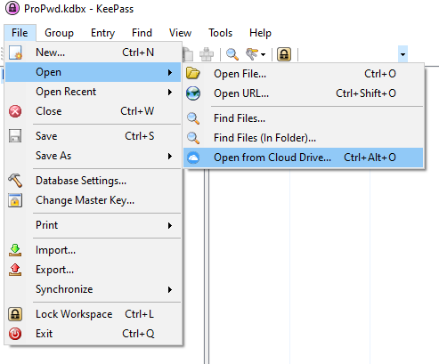
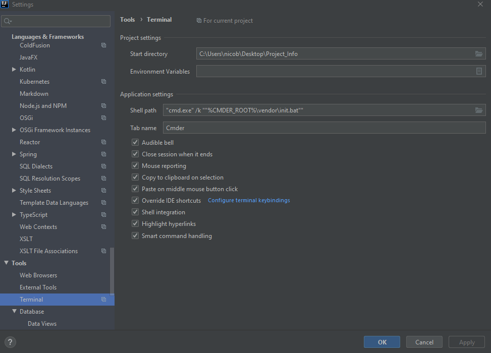
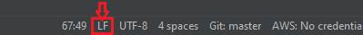

# Setup
How to setup the tools to be ready to use your computer 

## 1 :  Global Configuration 

Create a directory for your projects  
Create a environment variable for access the directory
```shell script
setx REPO_DIR "C:\Users\nicob\Desktop\Project"
```

## 2 : KeePass (Pwd Manager)
[Download KeePass](https://keepass.info/download.html)  
[Add plugin](https://keeanywhere.de/) for cloud storage, drop it in KeyPass/Plugin Folder   

If running default configuration :
```shell script
cd %userprofile%\Downloads
cp {KeeAnywhere}* C:\Program Files (x86)\KeePass Password Safe 2\Plugins
```  

On first us, you will to configure your cloud access



## 3 :  Cmder (Terminal)

#####Install Cmder
[Download Full Version](https://cmder.net) 
Unpack in %appdata% directory

#####Setup Env var

```shell script
setx CMDER_ROOT "%appdata%\cmder"
setx ConEmuDir "%appdata%\cmder\vendor\conemu-maximus5"
```

## 4 :  IntelliJ 

[Install IntelliJ Ultimate](https://www.jetbrains.com/fr-fr/idea/download/#section=windows)
_____
###Configure Terminal 

Ctrl+Alt+S &#8594; Terminal 

Start Directory :``Your/Project/Repo``  
Shell Path : ``"cmd.exe" /k ""%CMDER_ROOT%\vendor\init.bat""``
Tab Name : ``Cmder``



#####Verify UTF-8 encoding support
You might need to restart IntelliJ to make work properly the CLI

Check if UTF-8 encoding work properly 
```shell script
cmd /c %ConEmuDir%\ConEmu\Addons\utf-8-test.cmd
```
#####Verify LN Line separator
If IntelliJ dont use LF line separator, configure it  
Settings &#8594; Code Style &#8594; Line Separator : ``Unix and MacOs``

## 5 : Git

Git bash is already installed by Cmder, you only need to add your credentials.  
They will be required only on first connection.

 ```shell script
 git clone https://github.com/Kouraman/Setup.git
 ```

LF line separator should be activated, then, ask git to convert any crlf to lf line separator automatically
```
git config --global core.autocrlf input
```

## 6 : Docker

[Download Link](https://www.docker.com/get-started)